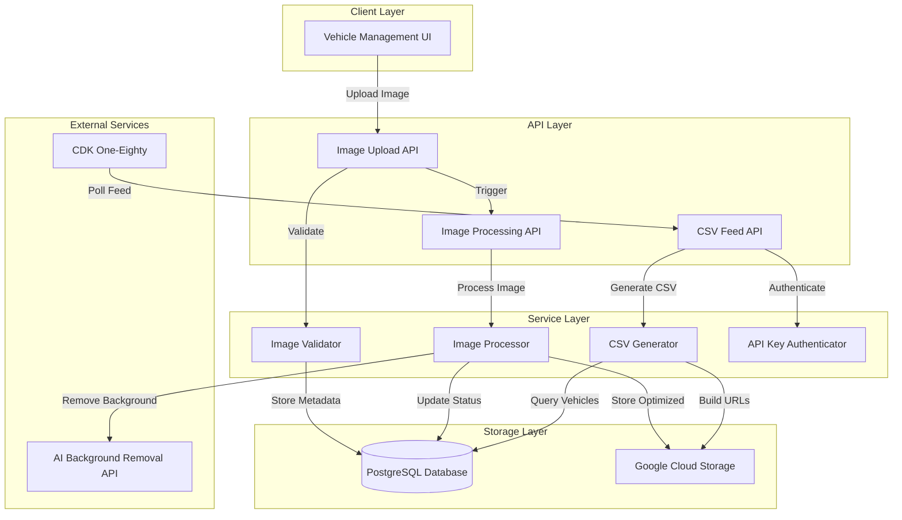

# Design Document: CDK One-Eighty Integration

## Overview

This design document specifies the implementation of a CDK One-Eighty DMS integration that enables automated vehicle inventory synchronization through a CSV feed polling mechanism. The system extends the existing vehicle management application to include VIN tracking, AI-powered image processing with Google Cloud Storage, and a secure CSV feed endpoint that CDK One-Eighty can poll to retrieve vehicle data with optimized image URLs.

The integration follows a three-phase workflow:
1. **Image Upload & Validation**: Photographers upload JPG/PNG images (max 4MB) which are validated and stored
2. **AI Processing**: Images are processed using an AI API for background removal and enhancement, with results stored in Google Cloud Storage
3. **CSV Feed Generation**: CDK One-Eighty polls a secure endpoint to retrieve vehicle inventory with optimized image URLs and cache-busting timestamps

## Architecture

### System Components



### Technology Stack

- **Framework**: Next.js 14+ with App Router
- **Database**: PostgreSQL with Prisma ORM
- **Cloud Storage**: Google Cloud Storage (@google-cloud/storage)
- **AI Processing**: Google AI API (Gemini/Vertex AI) for background removal and replacement
- **CSV Generation**: Built-in JavaScript string manipulation
- **Authentication**: Environment variable-based API key with constant-time comparison

### Data Flow

1. **Image Upload Flow**:
   - User uploads image via UI → Image Upload API validates format/size → Store in GCS → Save metadata to DB → Trigger processing

2. **Image Processing Flow**:
   - Processing API retrieves raw image → Send to AI API → Receive processed image → Store in GCS → Update DB with optimized URL and timestamps

3. **CSV Feed Flow**:
   - CDK One-Eighty requests feed with API key → Authenticate → Query vehicles with optimized images → Generate CSV with cache-busted URLs → Return response

## Components and Interfaces

### 1. Database Schema Updates

**Vehicle Model Extension**:
```typescript
model Vehicle {
  id               String           @id @default(cuid())
  stockNumber      String
  vin              String           // NEW: Required VIN field
  storeId          String
  processingStatus ProcessingStatus @default(NOT_STARTED)
  createdAt        DateTime         @default(now())
  updatedAt        DateTime         @updatedAt
  
  store            Store            @relation(fields: [storeId], references: [id], onDelete: Cascade)
  images           VehicleImage[]
  processingJobs   ProcessingJob[]
  
  @@index([vin])                    // NEW: Index for CSV queries
  @@unique([stockNumber, storeId])
  @@map("vehicles")
}
```

**VehicleImage Model Extension**:
```typescript
model VehicleImage {
  id           String    @id @default(cuid())
  vehicleId    String
  originalUrl  String
  processedUrl String?
  optimizedUrl String?   // NEW: Final optimized image URL from AI processing
  thumbnailUrl String
  imageType    ImageType
  sortOrder    Int       @default(0)
  isProcessed  Boolean   @default(false)
  isOptimized  Boolean   @default(false)  // NEW: Tracks AI processing completion
  processedAt  DateTime?                  // NEW: When AI processing completed
  uploadedAt   DateTime  @default(now())
  updatedAt    DateTime  @updatedAt       // NEW: For cache busting
  
  vehicle      Vehicle   @relation(fields: [vehicleId], references: [id], onDelete: Cascade)
  
  @@index([vehicleId])
  @@index([imageType])
  @@index([isOptimized])                   // NEW: For CSV feed queries
  @@map("vehicle_images")
}
```

### 2. Image Validator Service

**Purpose**: Validate uploaded images meet format and size requirements

**Interface**:
```typescript
interface ImageValidationResult {
  valid: boolean;
  error?: string;
  fileSize?: number;
  mimeType?: string;
}

class ImageValidator {
  private readonly MAX_SIZE = 4 * 1024 * 1024; // 4MB
  private readonly ALLOWED_TYPES = ['image/jpeg', 'image/png'];
  
  validate(file: File): ImageValidationResult;
  validateMimeType(mimeType: string): boolean;
  validateFileSize(size: number): boolean;
}
```

**Validation Rules**:
- File size must not exceed 4MB (4,194,304 bytes)
- MIME type must be `image/jpeg` or `image/png`
- File must have valid image headers


### 3. Google Cloud Storage Service

**Purpose**: Handle image storage and retrieval from GCS

**Interface**:
```typescript
interface GCSUploadResult {
  publicUrl: string;
  bucket: string;
  filename: string;
}

interface GCSConfig {
  projectId: string;
  bucketName: string;
  keyFilename?: string;  // Path to service account JSON
  credentials?: object;   // Or inline credentials
}

class GoogleCloudStorageService {
  private storage: Storage;
  private bucket: Bucket;
  
  constructor(config: GCSConfig);
  
  async uploadImage(
    file: Buffer,
    filename: string,
    contentType: string
  ): Promise<GCSUploadResult>;
  
  async getPublicUrl(filename: string): Promise<string>;
  
  async deleteImage(filename: string): Promise<void>;
  
  generateUniqueFilename(originalName: string, vehicleId: string): string;
}
```

**Configuration**:
- Environment variables: `GCS_PROJECT_ID`, `GCS_BUCKET_NAME`, `GCS_CREDENTIALS` (JSON string)
- Bucket must be configured with public read access for optimized images
- Use signed URLs for temporary access if needed

### 4. Image Processor Service

**Purpose**: Orchestrate AI-powered image processing workflow for key images only

**Key Image Types** (6 types that will be processed):
- `FRONT_QUARTER`
- `FRONT`
- `BACK_QUARTER`
- `BACK`
- `DRIVER_SIDE`
- `PASSENGER_SIDE`

**Gallery images** (`GALLERY`, `GALLERY_EXTERIOR`, `GALLERY_INTERIOR`) are NOT processed.

**Interface**:
```typescript
interface ProcessingResult {
  success: boolean;
  optimizedUrl?: string;
  error?: string;
  processedAt?: Date;
  skipped?: boolean;  // True for gallery images
}

interface AIProcessorConfig {
  apiKey: string;
  apiEndpoint: string;
  backgroundTemplates: Record<ImageType, string>;
}

interface BackgroundProcessingOptions {
  preserveVehicleDetails: boolean;
  adjustColorTemperature: boolean;
  blendMode: 'natural' | 'studio' | 'dramatic';
}

class ImageProcessorService {
  private gcsService: GoogleCloudStorageService;
  private aiConfig: AIProcessorConfig;
  
  // Key image types that should be processed
  private readonly KEY_IMAGE_TYPES = [
    'FRONT_QUARTER', 'FRONT', 'BACK_QUARTER',
    'BACK', 'DRIVER_SIDE', 'PASSENGER_SIDE'
  ];
  
  async processImage(
    vehicleImageId: string,
    originalUrl: string,
    imageType: ImageType
  ): Promise<ProcessingResult>;
  
  private shouldProcessImage(imageType: ImageType): boolean;
  private async downloadImage(url: string): Promise<Buffer>;
  private async removeAndReplaceBackground(
    imageBuffer: Buffer,
    imageType: ImageType,
    backgroundTemplate: string
  ): Promise<Buffer>;
  private async selectBackgroundTemplate(imageType: ImageType): Promise<string>;
  private async uploadOptimized(
    imageBuffer: Buffer,
    vehicleId: string,
    imageId: string
  ): Promise<string>;
}
```


**AI API Integration** (Google AI example):
```typescript
async removeAndReplaceBackground(
  imageBuffer: Buffer,
  imageType: ImageType,
  backgroundTemplate: string
): Promise<Buffer> {
  // Only process key images (6 types)
  const keyImageTypes = [
    'FRONT_QUARTER', 'FRONT', 'BACK_QUARTER', 
    'BACK', 'DRIVER_SIDE', 'PASSENGER_SIDE'
  ];
  
  if (!keyImageTypes.includes(imageType)) {
    // Return original for gallery images
    return imageBuffer;
  }
  
  // Use Google AI API for background removal
  const prompt = `Remove the background from this vehicle image. 
    Then composite the vehicle onto the provided background template.
    Adjust lighting and color temperature to blend naturally with the background.
    Do not add any elements to the vehicle itself.
    Maintain the vehicle's original appearance and details.`;
  
  const response = await fetch(process.env.GOOGLE_AI_ENDPOINT!, {
    method: 'POST',
    headers: {
      'Authorization': `Bearer ${process.env.GOOGLE_AI_API_KEY}`,
      'Content-Type': 'application/json',
    },
    body: JSON.stringify({
      image: imageBuffer.toString('base64'),
      backgroundTemplate: backgroundTemplate,
      prompt: prompt,
      parameters: {
        preserveVehicleDetails: true,
        adjustColorTemperature: true,
        blendMode: 'natural',
      }
    }),
  });
  
  if (!response.ok) {
    throw new Error(`Background processing failed: ${response.statusText}`);
  }
  
  const result = await response.json();
  return Buffer.from(result.processedImage, 'base64');
}
```

### 5. CSV Generator Service

**Purpose**: Generate CSV feed for CDK One-Eighty polling

**Interface**:
```typescript
interface VehicleFeedData {
  vin: string;
  stockNumber: string;
  imageUrls: string[];
}

interface CSVGeneratorConfig {
  baseUrl: string;  // For absolute URLs
}

class CSVGeneratorService {
  private config: CSVGeneratorConfig;
  
  async generateFeed(): Promise<string>;
  
  private async fetchVehiclesWithOptimizedImages(): Promise<VehicleFeedData[]>;
  private buildImageUrlWithCacheBuster(url: string, updatedAt: Date): string;
  private escapeCSVField(field: string): string;
  private formatCSVRow(data: VehicleFeedData): string;
}
```

**CSV Format**:
```csv
VIN,StockNumber,ImageURLs
1HGBH41JXMN109186,A12345,https://storage.googleapis.com/bucket/img1.jpg?v=1710000000|https://storage.googleapis.com/bucket/img2.jpg?v=1710000000
2HGBH41JXMN109187,B67890,https://storage.googleapis.com/bucket/img3.jpg?v=1710000001
```

**CSV Generation Logic**:
```typescript
async generateFeed(): Promise<string> {
  const vehicles = await this.fetchVehiclesWithOptimizedImages();
  
  const header = 'VIN,StockNumber,ImageURLs\r\n';
  const rows = vehicles.map(vehicle => {
    const imageUrls = vehicle.imageUrls
      .map(url => this.buildImageUrlWithCacheBuster(url, vehicle.updatedAt))
      .join('|');
    
    return `${this.escapeCSVField(vehicle.vin)},${this.escapeCSVField(vehicle.stockNumber)},${this.escapeCSVField(imageUrls)}\r\n`;
  });
  
  return header + rows.join('');
}
```


### 6. API Key Authenticator

**Purpose**: Secure CSV feed endpoint with API key authentication

**Interface**:
```typescript
interface AuthResult {
  authenticated: boolean;
  error?: string;
}

class APIKeyAuthenticator {
  private readonly validApiKey: string;
  
  constructor(apiKey: string);
  
  authenticate(providedKey: string | null): AuthResult;
  
  private constantTimeCompare(a: string, b: string): boolean;
}
```

**Implementation**:
```typescript
authenticate(providedKey: string | null): AuthResult {
  if (!providedKey) {
    return { authenticated: false, error: 'API key required' };
  }
  
  if (!this.constantTimeCompare(providedKey, this.validApiKey)) {
    return { authenticated: false, error: 'Invalid API key' };
  }
  
  return { authenticated: true };
}

// Constant-time comparison to prevent timing attacks
private constantTimeCompare(a: string, b: string): boolean {
  if (a.length !== b.length) {
    return false;
  }
  
  let result = 0;
  for (let i = 0; i < a.length; i++) {
    result |= a.charCodeAt(i) ^ b.charCodeAt(i);
  }
  
  return result === 0;
}
```

## Data Models

### VIN Validation

**Format**: 17-character alphanumeric string (excluding I, O, Q to avoid confusion)
**Validation Regex**: `^[A-HJ-NPR-Z0-9]{17}$`

**Validation Function**:
```typescript
function validateVIN(vin: string): boolean {
  if (vin.length !== 17) return false;
  return /^[A-HJ-NPR-Z0-9]{17}$/.test(vin);
}
```

### Image URL Structure

**Raw Image URL**: `https://storage.googleapis.com/{bucket}/raw/{vehicleId}/{imageId}.jpg`
**Optimized Image URL**: `https://storage.googleapis.com/{bucket}/optimized/{vehicleId}/{imageId}.jpg`
**Cache-Busted URL**: `{optimizedUrl}?v={unixTimestamp}`

### Environment Variables

```env
# Google Cloud Storage
GCS_PROJECT_ID=your-project-id
GCS_BUCKET_NAME=your-bucket-name
GCS_CREDENTIALS={"type":"service_account",...}

# AI Processing
GOOGLE_AI_API_KEY=your-google-ai-api-key
GOOGLE_AI_ENDPOINT=https://your-region-aiplatform.googleapis.com/v1/projects/your-project/locations/your-region/endpoints/your-endpoint
# OR for Gemini API
GEMINI_API_KEY=your-gemini-api-key

# CSV Feed Security
CDK_API_KEY=your-secret-api-key

# Application
NEXT_PUBLIC_BASE_URL=https://yourdomain.com
```


## Correctness Properties

*A property is a characteristic or behavior that should hold true across all valid executions of a system—essentially, a formal statement about what the system should do. Properties serve as the bridge between human-readable specifications and machine-verifiable correctness guarantees.*

### Property 1: VIN Validation Rejects Invalid Inputs

*For any* string that is not exactly 17 characters or contains invalid characters (I, O, Q, or non-alphanumeric), the VIN validation function should reject it and return a descriptive error message.

**Validates: Requirements 1.2, 1.3, 1.4**

### Property 2: Image Format Validation

*For any* uploaded file, if the MIME type is not `image/jpeg` or `image/png`, the validation should fail and return an error message indicating that only JPG and PNG formats are accepted.

**Validates: Requirements 2.1, 2.3**

### Property 3: Image Size Validation

*For any* uploaded file, if the file size exceeds 4MB (4,194,304 bytes), the validation should fail and return an error message indicating the 4MB maximum size limit.

**Validates: Requirements 2.2, 2.4**

### Property 4: Valid Images Are Accepted

*For any* file that is JPG or PNG format and ≤4MB in size, the validation should pass and the system should accept the image for storage.

**Validates: Requirements 2.5**

### Property 5: Image State Transitions

*For any* vehicle image, when first uploaded the isOptimized flag should be false, and after successful AI processing completes, the isOptimized flag should be true with a processedAt timestamp recorded.

**Validates: Requirements 4.1, 4.2, 4.3, 9.5, 9.6**

### Property 6: Dual URL Storage

*For any* processed vehicle image, the database should contain both the originalUrl (raw image) and optimizedUrl (AI-processed image) after processing completes.

**Validates: Requirements 4.4**

### Property 7: Processing Timestamp Consistency

*For any* image that completes processing, the processedAt timestamp should be set and should be greater than or equal to the uploadedAt timestamp.

**Validates: Requirements 3.5, 4.5**


### Property 8: CSV Feed Includes Only Optimized Vehicles

*For any* generated CSV feed, all vehicles included in the feed should have at least one image where isOptimized is true, and no vehicles without optimized images should appear.

**Validates: Requirements 5.2**

### Property 9: CSV Structure Compliance

*For any* generated CSV feed, the first row should contain the headers "VIN,StockNumber,ImageURLs" and all subsequent rows should have exactly three comma-separated fields.

**Validates: Requirements 5.3, 8.1, 8.4**

### Property 10: Multiple Image URL Concatenation

*For any* vehicle with multiple optimized images, the ImageURLs field in the CSV should contain all image URLs separated by pipe (|) characters.

**Validates: Requirements 5.4**

### Property 11: Absolute URL Format

*For any* image URL in the CSV feed, the URL should be absolute (starting with http:// or https://) and should be publicly accessible.

**Validates: Requirements 5.5**

### Property 12: CSV Field Escaping

*For any* CSV field that contains commas, double quotes, or newlines, the field should be enclosed in double quotes, and any double quotes within the field should be escaped by doubling them ("").

**Validates: Requirements 8.2, 8.3**

### Property 13: CSV Line Terminator Format

*For any* generated CSV feed, all lines should be terminated with CRLF (\r\n) characters.

**Validates: Requirements 8.5**

### Property 14: Cache Buster URL Format

*For any* image URL in the CSV feed, the URL should include a version query parameter in the format ?v={unix_timestamp} where the timestamp matches the image's updatedAt field.

**Validates: Requirements 6.1, 6.2, 6.3**

### Property 15: Timestamp Update on Image Modification

*For any* image that is updated or reprocessed, the updatedAt timestamp should change to a newer value, causing the cache-buster version parameter to change.

**Validates: Requirements 6.4**

### Property 16: Feed URL Idempotence

*For any* image that has not been modified, generating the CSV feed multiple times should produce identical URLs with the same version parameter.

**Validates: Requirements 6.5**

### Property 17: API Key Authentication Requirement

*For any* request to the CSV feed endpoint without a "key" query parameter, the system should return HTTP 401 Unauthorized status.

**Validates: Requirements 7.1**

### Property 18: Valid API Key Grants Access

*For any* request to the CSV feed endpoint with the correct API key, the system should process the request and return the CSV feed with HTTP 200 status.

**Validates: Requirements 7.4**


### Property 19: Authentication Error Response Format

*For any* request that fails authentication (missing or invalid API key), the system should return a JSON response containing an error message field.

**Validates: Requirements 7.7**

### Property 20: Error Logging Contains Context

*For any* error that occurs during CSV generation, image processing, or validation, the system should log the error with relevant context (vehicle ID, image ID, operation type, timestamp).

**Validates: Requirements 11.1, 11.2, 11.3, 11.6, 11.7**

### Property 21: Error Responses Hide Sensitive Data

*For any* error response returned to clients, the response should not contain sensitive information such as API keys, database credentials, internal file paths, or stack traces.

**Validates: Requirements 11.5**

### Property 22: Processing Failure Handling

*For any* image processing operation that fails (AI API error, network error, storage error), the system should return a failure status and log the error without crashing.

**Validates: Requirements 3.6**

### Property 23: GCS Storage Verification

*For any* image that is successfully processed, querying Google Cloud Storage for the optimized image URL should return the image file.

**Validates: Requirements 3.2, 3.4**

## Error Handling

### Error Categories

1. **Validation Errors** (HTTP 400):
   - Invalid VIN format
   - Invalid image format (not JPG/PNG)
   - Image size exceeds 4MB
   - Missing required fields

2. **Authentication Errors**:
   - HTTP 401: Missing API key
   - HTTP 403: Invalid API key

3. **Processing Errors** (HTTP 500):
   - AI API unavailable or returns error
   - Google Cloud Storage upload failure
   - Database query failure
   - Network timeout

4. **Not Found Errors** (HTTP 404):
   - Vehicle not found
   - Image not found

### Error Response Format

```typescript
interface ErrorResponse {
  error: string;           // User-friendly error message
  code: string;            // Error code for client handling
  timestamp: string;       // ISO 8601 timestamp
  requestId?: string;      // For tracking in logs
}
```

### Logging Strategy

- **Info Level**: Successful operations, API requests
- **Warn Level**: Validation failures, authentication failures
- **Error Level**: Processing failures, external service errors, database errors
- **Debug Level**: Detailed operation flow for troubleshooting

**Log Format**:
```typescript
{
  level: 'error',
  timestamp: '2024-01-13T10:30:00Z',
  operation: 'image-processing',
  vehicleId: 'abc123',
  imageId: 'img456',
  error: 'AI API timeout',
  context: { apiEndpoint: 'https://api.remove.bg', timeout: 30000 }
}
```


## Testing Strategy

### Dual Testing Approach

This feature requires both unit tests and property-based tests to ensure comprehensive coverage:

- **Unit tests**: Verify specific examples, edge cases, and error conditions
- **Property tests**: Verify universal properties across all inputs

Both testing approaches are complementary and necessary. Unit tests catch concrete bugs in specific scenarios, while property tests verify general correctness across a wide range of inputs.

### Property-Based Testing

**Framework**: fast-check (TypeScript property-based testing library)

**Configuration**:
- Minimum 100 iterations per property test
- Each test must reference its design document property
- Tag format: `Feature: cdk-one-eighty-integration, Property {number}: {property_text}`

**Test Organization**:
```
tests/
  properties/
    cdk-vin-validation.properties.test.ts
    cdk-image-validation.properties.test.ts
    cdk-csv-generation.properties.test.ts
    cdk-cache-busting.properties.test.ts
    cdk-authentication.properties.test.ts
  unit/
    vin-validator.test.ts
    image-validator.test.ts
    csv-generator.test.ts
    api-key-auth.test.ts
    gcs-service.test.ts
```

### Property Test Examples

**Property 1: VIN Validation**
```typescript
import fc from 'fast-check';

// Feature: cdk-one-eighty-integration, Property 1: VIN Validation Rejects Invalid Inputs
test('invalid VINs are rejected with descriptive errors', () => {
  fc.assert(
    fc.property(
      fc.oneof(
        fc.string().filter(s => s.length !== 17),  // Wrong length
        fc.string({ minLength: 17, maxLength: 17 }).filter(s => /[IOQ]/.test(s)),  // Invalid chars
      ),
      (invalidVin) => {
        const result = validateVIN(invalidVin);
        expect(result.valid).toBe(false);
        expect(result.error).toBeDefined();
        expect(result.error).toMatch(/VIN|17|character/i);
      }
    ),
    { numRuns: 100 }
  );
});
```

**Property 8: CSV Feed Filtering**
```typescript
// Feature: cdk-one-eighty-integration, Property 8: CSV Feed Includes Only Optimized Vehicles
test('CSV feed includes only vehicles with optimized images', async () => {
  fc.assert(
    fc.asyncProperty(
      fc.array(fc.record({
        vin: fc.string({ minLength: 17, maxLength: 17 }),
        stockNumber: fc.string(),
        hasOptimizedImages: fc.boolean(),
      })),
      async (vehicles) => {
        // Setup: Create vehicles in test database
        await setupTestVehicles(vehicles);
        
        // Generate CSV feed
        const csv = await generateFeed();
        const rows = csv.split('\r\n').slice(1); // Skip header
        
        // Verify: Only vehicles with optimized images appear
        const expectedCount = vehicles.filter(v => v.hasOptimizedImages).length;
        expect(rows.filter(r => r.length > 0).length).toBe(expectedCount);
        
        // Verify: All VINs in CSV have optimized images
        rows.forEach(row => {
          if (row.length > 0) {
            const vin = row.split(',')[0];
            const vehicle = vehicles.find(v => v.vin === vin);
            expect(vehicle?.hasOptimizedImages).toBe(true);
          }
        });
      }
    ),
    { numRuns: 100 }
  );
});
```

### Unit Test Focus Areas

1. **VIN Validation Edge Cases**:
   - Empty string
   - Exactly 17 characters with valid format
   - 16 and 18 character strings
   - Strings containing I, O, Q

2. **Image Validation Edge Cases**:
   - Exactly 4MB file
   - 4MB + 1 byte file
   - Empty file
   - Corrupted image headers

3. **CSV Generation Edge Cases**:
   - No vehicles in database
   - Vehicle with no images
   - Vehicle with 100+ images
   - Special characters in stock numbers (commas, quotes, newlines)

4. **Authentication Edge Cases**:
   - Empty API key
   - API key with extra whitespace
   - Case-sensitive key comparison

5. **Error Handling**:
   - AI API returns 500 error
   - GCS upload timeout
   - Database connection lost
   - Malformed AI API response

### Integration Testing

**Test Scenarios**:
1. End-to-end image upload → processing → CSV generation flow
2. CDK One-Eighty polling simulation with authentication
3. Concurrent image processing requests
4. Large batch CSV generation (1000+ vehicles)

### Mock Strategy

- **Mock AI API**: Use nock or msw to mock Remove.bg API responses
- **Mock GCS**: Use @google-cloud/storage memory implementation for tests
- **Mock Database**: Use in-memory SQLite or test database with Prisma
- **Real CSV Generation**: Test actual CSV formatting logic without mocks

### Performance Testing

- CSV generation should complete in <5 seconds for 1000 vehicles
- Image processing should complete in <30 seconds per image
- API key authentication should add <10ms overhead


## Cloud Infrastructure Setup Guide

### Prerequisites

- Google Cloud Platform account
- Node.js 18+ installed
- Project with billing enabled

### Step 1: Create Google Cloud Project

1. Go to [Google Cloud Console](https://console.cloud.google.com/)
2. Click "Select a project" → "New Project"
3. Enter project name (e.g., "vehicle-inventory-app")
4. Note the Project ID (you'll need this later)
5. Click "Create"

### Step 2: Enable Required APIs

1. In the Cloud Console, go to "APIs & Services" → "Library"
2. Search for and enable:
   - **Cloud Storage API**
   - **Cloud Storage JSON API**

### Step 3: Create Google Cloud Storage Bucket

1. Go to "Cloud Storage" → "Buckets"
2. Click "Create Bucket"
3. Configure bucket:
   - **Name**: Choose a globally unique name (e.g., `your-app-vehicle-images`)
   - **Location type**: Region (choose closest to your users)
   - **Storage class**: Standard
   - **Access control**: Fine-grained (recommended)
   - **Protection tools**: None (or enable versioning if desired)
4. Click "Create"

### Step 4: Configure Bucket Permissions

1. Select your bucket
2. Go to "Permissions" tab
3. Click "Grant Access"
4. Add principal: `allUsers`
5. Role: "Storage Object Viewer" (for public read access to optimized images)
6. Click "Save"

**Note**: Only the `optimized/` folder needs public access. You can set folder-level permissions or use signed URLs for raw images.

### Step 5: Create Service Account

1. Go to "IAM & Admin" → "Service Accounts"
2. Click "Create Service Account"
3. Configure:
   - **Name**: `vehicle-app-storage`
   - **Description**: "Service account for vehicle image storage"
4. Click "Create and Continue"
5. Grant roles:
   - **Storage Admin** (for full bucket access)
   - **Storage Object Admin** (for object management)
6. Click "Continue" → "Done"

### Step 6: Generate Service Account Key

1. Click on the service account you just created
2. Go to "Keys" tab
3. Click "Add Key" → "Create new key"
4. Select "JSON" format
5. Click "Create"
6. Save the downloaded JSON file securely (you'll need it for environment variables)

**Security Warning**: Never commit this JSON file to version control!

### Step 7: Configure Environment Variables

Add these to your `.env` file:

```env
# Google Cloud Storage Configuration
GCS_PROJECT_ID=your-project-id
GCS_BUCKET_NAME=your-app-vehicle-images

# Option 1: Use JSON file path (for local development)
GCS_KEY_FILE_PATH=./path/to/service-account-key.json

# Option 2: Use inline credentials (for production/Vercel)
GCS_CREDENTIALS='{"type":"service_account","project_id":"your-project-id",...}'
```

**For Vercel/Production**:
1. Copy the entire contents of the service account JSON file
2. Minify it (remove whitespace): `cat key.json | jq -c`
3. Set as environment variable `GCS_CREDENTIALS`

### Step 8: Install Required Packages

```bash
npm install @google-cloud/storage
```

### Step 9: Test GCS Connection

Create a test script `test-gcs.js`:

```javascript
const { Storage } = require('@google-cloud/storage');

async function testGCS() {
  const storage = new Storage({
    projectId: process.env.GCS_PROJECT_ID,
    keyFilename: process.env.GCS_KEY_FILE_PATH,
    // OR use credentials: JSON.parse(process.env.GCS_CREDENTIALS)
  });

  const bucket = storage.bucket(process.env.GCS_BUCKET_NAME);
  
  try {
    const [exists] = await bucket.exists();
    console.log(`✓ Bucket exists: ${exists}`);
    
    // Test upload
    const testFile = Buffer.from('test content');
    const file = bucket.file('test/test.txt');
    await file.save(testFile);
    console.log('✓ Upload successful');
    
    // Test public URL
    const publicUrl = `https://storage.googleapis.com/${bucket.name}/test/test.txt`;
    console.log(`✓ Public URL: ${publicUrl}`);
    
    // Cleanup
    await file.delete();
    console.log('✓ Cleanup successful');
    
    console.log('\n✅ GCS setup is working correctly!');
  } catch (error) {
    console.error('❌ GCS test failed:', error.message);
  }
}

testGCS();
```

Run: `node test-gcs.js`

### Step 10: Configure Google AI API for Image Processing

#### Enable Vertex AI or Gemini API

**Option A: Vertex AI (Recommended for production)**

1. In Google Cloud Console, go to "Vertex AI"
2. Click "Enable API"
3. Go to "Model Garden" or "Vision AI"
4. Select an image processing model that supports:
   - Background removal/segmentation
   - Image composition
   - Color adjustment

**Option B: Gemini API with Vision**

1. Go to [Google AI Studio](https://makersuite.google.com/)
2. Get your API key
3. Gemini Pro Vision can handle image processing tasks

#### Configure Environment Variables

Add to `.env`:
```env
# Option A: Vertex AI
GOOGLE_AI_API_KEY=your-service-account-key
GOOGLE_AI_ENDPOINT=https://us-central1-aiplatform.googleapis.com/v1/projects/YOUR_PROJECT/locations/us-central1/endpoints/YOUR_ENDPOINT
GOOGLE_AI_PROJECT_ID=your-project-id

# Option B: Gemini API
GEMINI_API_KEY=your-gemini-api-key
```

#### Prepare Background Templates

1. Create a folder in your GCS bucket: `backgrounds/`
2. Upload pre-designed background images:
   - `backgrounds/studio-white.jpg`
   - `backgrounds/studio-gray.jpg`
   - `backgrounds/outdoor-showroom.jpg`
   - `backgrounds/gradient-blue.jpg`
   - etc.

3. Map image types to backgrounds:
```typescript
const BACKGROUND_TEMPLATES = {
  FRONT_QUARTER: 'backgrounds/studio-white.jpg',
  FRONT: 'backgrounds/studio-white.jpg',
  BACK_QUARTER: 'backgrounds/studio-gray.jpg',
  BACK: 'backgrounds/studio-gray.jpg',
  DRIVER_SIDE: 'backgrounds/gradient-blue.jpg',
  PASSENGER_SIDE: 'backgrounds/gradient-blue.jpg',
};
```

### Step 11: Test Google AI API Connection

Create `test-google-ai.js`:

```javascript
const fetch = require('node-fetch');
const fs = require('fs');

async function testGoogleAI() {
  // Read a test vehicle image
  const testImage = fs.readFileSync('./test-vehicle.jpg');
  const base64Image = testImage.toString('base64');

  const prompt = `Remove the background from this vehicle image and replace it with a clean white studio background. Adjust the lighting to blend naturally. Do not modify the vehicle itself.`;

  try {
    // Example for Gemini API
    const response = await fetch(
      `https://generativelanguage.googleapis.com/v1/models/gemini-pro-vision:generateContent?key=${process.env.GEMINI_API_KEY}`,
      {
        method: 'POST',
        headers: { 'Content-Type': 'application/json' },
        body: JSON.stringify({
          contents: [{
            parts: [
              { text: prompt },
              { inline_data: { mime_type: 'image/jpeg', data: base64Image } }
            ]
          }]
        })
      }
    );

    if (response.ok) {
      console.log('✅ Google AI API is working!');
      const result = await response.json();
      console.log('Response:', result);
    } else {
      console.error('❌ API error:', response.status, await response.text());
    }
  } catch (error) {
    console.error('❌ Connection failed:', error.message);
  }
}

testGoogleAI();
```

Run: `node test-google-ai.js`

### Step 12: Configure CDK API Key

Generate a secure API key for the CSV feed:

```bash
# Generate a random 32-character key
node -e "console.log(require('crypto').randomBytes(32).toString('hex'))"
```

Add to `.env`:
```env
CDK_API_KEY=your-generated-secure-key-here
```

**Share this key securely with CDK One-Eighty** so they can poll your feed.

### Step 13: Verify Complete Setup

Create a checklist:

- [ ] Google Cloud project created
- [ ] Cloud Storage API enabled
- [ ] GCS bucket created with public read access
- [ ] Service account created with Storage Admin role
- [ ] Service account key downloaded and configured
- [ ] GCS connection test passed
- [ ] AI API account created
- [ ] AI API key configured
- [ ] AI API connection test passed
- [ ] CDK API key generated and configured
- [ ] All environment variables set in `.env`
- [ ] Environment variables configured in production (Vercel/hosting platform)

### Troubleshooting

**Issue**: "Permission denied" when uploading to GCS
- **Solution**: Verify service account has "Storage Admin" role
- Check that bucket name in code matches actual bucket name

**Issue**: "Bucket not found"
- **Solution**: Verify `GCS_BUCKET_NAME` environment variable is correct
- Ensure bucket exists in the correct project

**Issue**: AI API returns 403 Forbidden
- **Solution**: Check API key is correct
- Verify account has remaining credits/quota

**Issue**: Images not publicly accessible
- **Solution**: Verify bucket has `allUsers` with "Storage Object Viewer" role
- Check that files are in the correct folder with public permissions

### Security Best Practices

1. **Never commit credentials**: Add `*.json`, `.env` to `.gitignore`
2. **Use environment variables**: Different keys for dev/staging/production
3. **Rotate keys regularly**: Generate new service account keys every 90 days
4. **Limit permissions**: Use least-privilege principle for service accounts
5. **Monitor usage**: Set up billing alerts and API usage monitoring
6. **Secure API keys**: Use secrets management (Vercel Secrets, AWS Secrets Manager, etc.)

### Cost Estimation

**Google Cloud Storage**:
- Storage: ~$0.02/GB/month (Standard class)
- Network egress: ~$0.12/GB (to internet)
- Operations: Minimal cost for API calls

**Google AI API** (Vertex AI or Gemini):
- Free tier: Varies by model and usage
- Vertex AI: Pay-per-request based on model
- Gemini API: Check current pricing at [ai.google.dev](https://ai.google.dev)

**Example**: 1000 vehicles × 6 key images each = 6,000 images
- Storage: ~6GB = $0.12/month
- Processing: 6,000 × $0.10-0.50 = $600-3,000 one-time (estimate)
- Bandwidth: Depends on CDK polling frequency

**Recommendation**: Start with free tiers and monitor usage before scaling.
