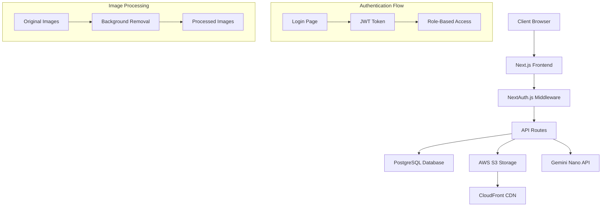

# Design Document: Vehicle Inventory Tool

## Overview

The Mark Motors Group Vehicle Inventory Tool is a Next.js 14 web application that provides role-based access for managing vehicle inventory photos across 9 dealership locations. The system integrates with Gemini Nano Banana 25 flash for automated background removal on key vehicle images, featuring a responsive interface for photo management, drag-and-drop reordering, and bulk operations.

## Architecture

### Technology Stack

- **Frontend**: Next.js 14 with TypeScript, Tailwind CSS for styling
- **Authentication**: NextAuth.js with JWT tokens for session management
- **Database**: PostgreSQL with Prisma ORM for structured data relationships
- **File Storage**: AWS S3 for image storage with CloudFront CDN
- **Image Processing**: Gemini Nano Banana 25 flash API integration
- **Drag & Drop**: @dnd-kit/core for accessible drag-and-drop functionality
- **Image Optimization**: Next.js Image component with automatic WebP conversion

### System Architecture



## Components and Interfaces

### Core Components

#### Authentication System

- **LoginPage**: Displays MMG branding with email/password form
- **AuthProvider**: Manages authentication state and role-based permissions
- **ProtectedRoute**: HOC for route protection based on user roles
- **RoleGuard**: Component-level access control for Admin-only features

#### Store Management

- **StoreSelector**: Grid layout displaying 9 MMG dealership locations
- **StoreCard**: Individual store representation with branding and address
- **StoreProvider**: Context for managing selected store state

#### Vehicle Inventory

- **VehicleList**: Paginated table with sorting, filtering, and bulk operations
- **VehicleCard**: Individual vehicle row with thumbnail, metadata, and actions
- **AddVehicleModal**: Form for creating new vehicle records
- **BulkActions**: Admin-only component for multi-select operations

#### Image Gallery

- **ImageGallery**: Main container organizing key images and gallery photos
- **KeyImageGrid**: Specialized layout for 6 standardized vehicle shots
- **GalleryGrid**: Four-column responsive grid for additional photos
- **DraggableImage**: Individual image component with drag-and-drop capabilities
- **ImageUploader**: Drag-and-drop file upload with progress indicators
- **ProcessingButton**: Triggers background removal for key images

### API Interfaces

#### Authentication Endpoints

```typescript
// POST /api/auth/login
interface LoginRequest {
  email: string
  password: string
}

interface LoginResponse {
  user: {
    id: string
    email: string
    role: 'PHOTOGRAPHER' | 'ADMIN'
    name: string
  }
  token: string
}
```

#### Vehicle Management

```typescript
// GET /api/vehicles?storeId=string&page=number&search=string
interface VehicleListResponse {
  vehicles: Vehicle[]
  totalCount: number
  currentPage: number
}

// POST /api/vehicles
interface CreateVehicleRequest {
  stockNumber: string
  storeId: string
  images?: File[]
}
```

#### Image Processing

```typescript
// POST /api/images/process
interface ProcessImageRequest {
  vehicleId: string
  imageIds: string[]
  targetBackground: string // Fixed background for consistency
}

interface ProcessImageResponse {
  jobId: string
  status: 'QUEUED' | 'PROCESSING' | 'COMPLETED' | 'FAILED'
  processedImages?: ProcessedImage[]
}
```

## Data Models

### Database Schema

```typescript
// User Model
interface User {
  id: string
  email: string
  passwordHash: string
  role: 'PHOTOGRAPHER' | 'ADMIN'
  name: string
  createdAt: Date
  updatedAt: Date
}

// Store Model
interface Store {
  id: string
  name: string
  address: string
  brandLogos: string[] // Array of brand logo URLs
  vehicles: Vehicle[]
}

// Vehicle Model
interface Vehicle {
  id: string
  stockNumber: string
  storeId: string
  store: Store
  images: VehicleImage[]
  processingStatus: 'NOT_STARTED' | 'IN_PROGRESS' | 'COMPLETED' | 'ERROR'
  createdAt: Date
  updatedAt: Date
}

// VehicleImage Model
interface VehicleImage {
  id: string
  vehicleId: string
  vehicle: Vehicle
  originalUrl: string
  processedUrl?: string
  thumbnailUrl: string
  imageType:
    | 'FRONT_QUARTER'
    | 'FRONT'
    | 'BACK_QUARTER'
    | 'BACK'
    | 'DRIVER_SIDE'
    | 'PASSENGER_SIDE'
    | 'GALLERY'
  sortOrder: number
  isProcessed: boolean
  uploadedAt: Date
}

// ProcessingJob Model
interface ProcessingJob {
  id: string
  vehicleId: string
  imageIds: string[]
  status: 'QUEUED' | 'PROCESSING' | 'COMPLETED' | 'FAILED'
  errorMessage?: string
  createdAt: Date
  completedAt?: Date
}
```

### File Storage Structure

```
s3://mmg-vehicle-inventory/
├── stores/
│   ├── {storeId}/
│   │   ├── vehicles/
│   │   │   ├── {vehicleId}/
│   │   │   │   ├── original/
│   │   │   │   │   ├── {imageId}.jpg
│   │   │   │   ├── processed/
│   │   │   │   │   ├── {imageId}_processed.jpg
│   │   │   │   └── thumbnails/
│   │   │   │       ├── {imageId}_thumb.jpg
```

## Correctness Properties

_A property is a characteristic or behavior that should hold true across all valid executions of a system-essentially, a formal statement about what the system should do. Properties serve as the bridge between human-readable specifications and machine-verifiable correctness guarantees._

Now I need to analyze the acceptance criteria to determine which ones can be tested as properties.

### Converting EARS to Properties

Based on the prework analysis, I'll convert the testable acceptance criteria into universally quantified properties:

**Property 1: Authentication and Access Control**
_For any_ user credentials, valid credentials should result in successful authentication and redirect, while invalid credentials should display errors and remain on login page. Unauthenticated access to protected routes should always redirect to login.
**Validates: Requirements 1.2, 1.3, 1.5**

**Property 2: Store-Specific Data Loading**
_For any_ store selection, the system should load and display only vehicles belonging to that specific store, and switching stores should update the vehicle list accordingly.
**Validates: Requirements 2.2, 2.4**

**Property 3: Vehicle List Sorting and Display**
_For any_ vehicle list, vehicles should always be sorted by stock number in ascending order and display all required information (stock number, thumbnail, photo count, creation date, processing status).
**Validates: Requirements 3.1, 3.2**

**Property 4: Role-Based Access Control**
_For any_ user role, Admin users should see selection controls and bulk operations while Photographer users should not, and only Admins should be able to reprocess finished images.
**Validates: Requirements 3.4, 5.4**

**Property 5: Search and Filtering**
_For any_ search query, the system should return only vehicles whose stock numbers match the search criteria.
**Validates: Requirements 3.6**

**Property 6: Vehicle Navigation and Detail Display**
_For any_ vehicle record, clicking it should navigate to its detail page with complete vehicle information.
**Validates: Requirements 4.1**

**Property 7: Photo Interaction and Management**
_For any_ photo in the gallery, drag-and-drop should update and persist the new order, hovering should display delete button, and clicking delete should show confirmation dialog.
**Validates: Requirements 4.4, 4.5, 4.6**

**Property 8: Processing Status Management**
_For any_ vehicle processing operation, starting processing should update status to "In Progress", successful completion should update to "Finished" and display results, and failures should update to "Error" with appropriate messages.
**Validates: Requirements 5.2, 5.3, 5.5**

**Property 9: Key Image Processing Scope**
_For any_ vehicle, background processing should only apply to the 6 key images (Front Quarter, Front, Back Quarter, Back, Driver Side Profile, Passenger Side Profile) and not affect gallery images.
**Validates: Requirements 4.7, 4.8, 5.1, 5.8**

**Property 10: Image Preservation and Download**
_For any_ processed image, the system should maintain both original and processed versions, and provide download functionality for processed images.
**Validates: Requirements 5.6, 5.7**

**Property 11: Photo Upload and Categorization**
_For any_ photo upload operation, the system should accept multiple files, categorize them correctly based on user designation, validate file formats and sizes, generate thumbnails, and update photo counts.
**Validates: Requirements 6.1, 6.2, 6.3, 6.4, 6.5**

**Property 12: Data Persistence and Integrity**
_For any_ data modification, changes should be immediately persisted to the database, and referential integrity should be maintained between vehicles, stores, and photos.
**Validates: Requirements 7.3, 7.4**

**Property 13: User Interface Responsiveness**
_For any_ user interaction, the system should provide immediate visual feedback and maintain accessibility compliance.
**Validates: Requirements 8.4, 8.5**

## Error Handling

### Authentication Errors

- Invalid credentials display user-friendly error messages
- Session expiration redirects to login with context preservation
- Network failures show retry options with offline indicators

### File Upload Errors

- Unsupported file formats show specific format requirements
- File size limits display clear size restrictions and compression suggestions
- Network interruptions allow upload resumption

### Image Processing Errors

- API failures provide retry mechanisms with exponential backoff
- Processing timeouts show estimated completion times
- Invalid image formats are detected before processing begins

### Database Errors

- Connection failures implement automatic retry with circuit breaker pattern
- Constraint violations show user-friendly validation messages
- Transaction failures maintain data consistency with rollback procedures

## Testing Strategy

### Dual Testing Approach

The system will use both unit testing and property-based testing for comprehensive coverage:

**Unit Tests**: Focus on specific examples, edge cases, and integration points

- Authentication flow with known credentials
- UI component rendering with mock data
- API endpoint responses with specific payloads
- Error boundary behavior with simulated failures

**Property-Based Tests**: Verify universal properties across all inputs using fast-check library

- Minimum 100 iterations per property test
- Each test tagged with format: **Feature: vehicle-inventory-tool, Property {number}: {property_text}**
- Comprehensive input coverage through randomization
- Universal correctness validation

**Testing Configuration**:

- Property tests run with 100+ iterations for thorough coverage
- Unit tests focus on specific scenarios and edge cases
- Integration tests validate component interactions
- End-to-end tests verify complete user workflows

**Test Organization**:

```
tests/
├── unit/
│   ├── components/
│   ├── api/
│   └── utils/
├── integration/
│   ├── auth/
│   ├── vehicle-management/
│   └── image-processing/
├── properties/
│   ├── auth.properties.test.ts
│   ├── vehicle.properties.test.ts
│   └── image.properties.test.ts
└── e2e/
    ├── photographer-workflow.spec.ts
    └── admin-workflow.spec.ts
```

The combination of unit and property tests ensures both concrete bug detection and general correctness validation across the entire input space.
